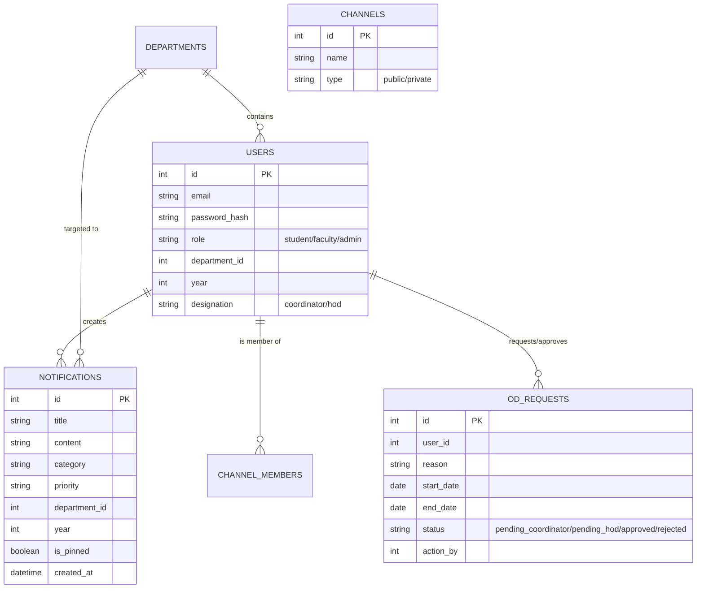
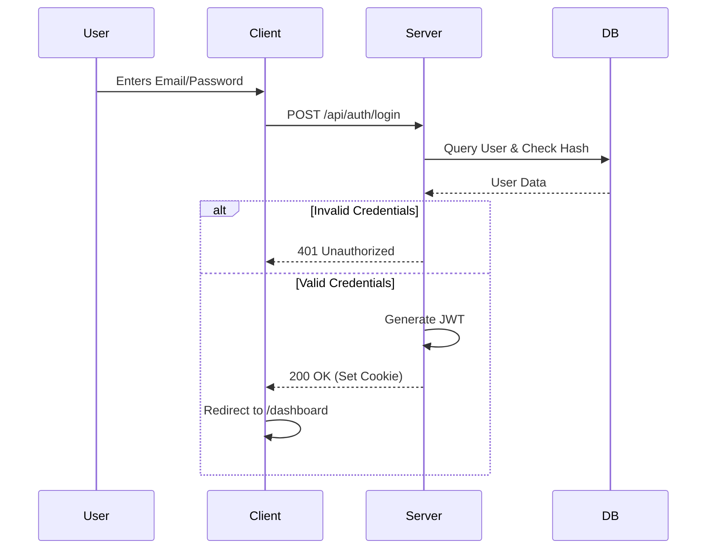
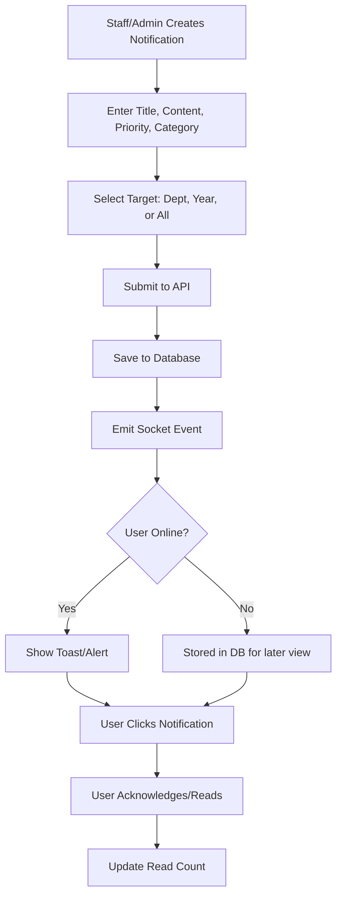
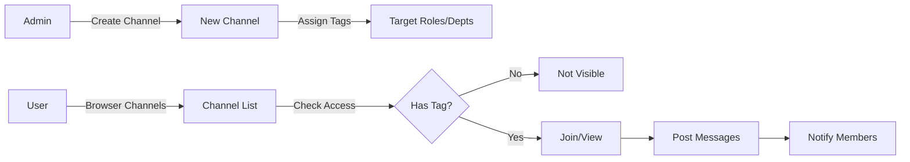
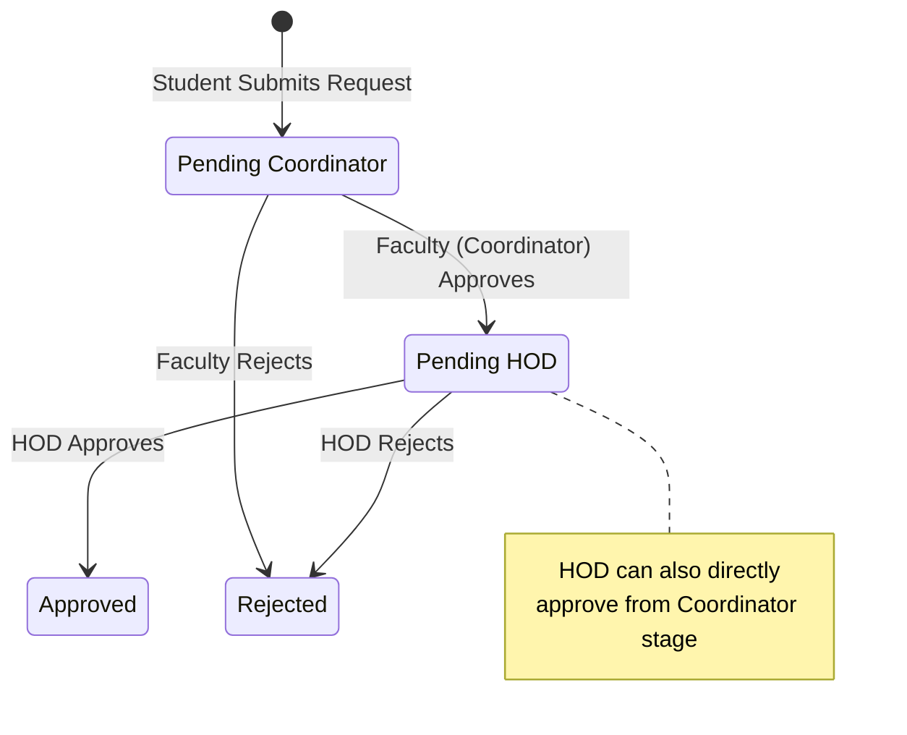

# GCE Smart Notify - Project Documentation

## 1. Project Overview
**GCE Smart Notify** is an intelligent digital campus notification and communication system designed to streamline information flow between students, faculty, and administrators. It replaces traditional notice boards and fragmented messaging apps with a unified, role-based platform.

### Key Features
-   **Role-Based Access Control (RBAC)**: Distinct interfaces and permissions for Students, Faculty (Coordinators/HODs), and Administrators.
-   **Real-time Notifications**: Instant alerts for academic, exam, and event updates.
-   **Targeted Communication**: Notifications filtered by Year, Department, and Role.
-   **Channel-Based Chat**: Discord-like channels for specific topics or groups (e.g., "Placement", "Sports").
-   **On-Duty (OD) Management**: Digital workflow for students to request ODs and faculty to approve them.
-   **User Management**: Admin tools to manage users, assign roles, and handle department data.

---

## 2. Technology Stack

### Frontend
-   **Framework**: Next.js 14+ (App Router)
-   **Language**: TypeScript
-   **Styling**: Tailwind CSS (Custom "X/Twitter" Dark Mode Theme)
-   **State Management**: React Context (AuthContext)
-   **Icons**: React Icons (Feather Icons)
-   **HTTP Client**: Axios

### Backend
-   **Runtime**: Node.js
-   **Framework**: Express.js
-   **Language**: JavaScript (CommonJS)
-   **Real-time Engine**: Socket.io (Integration ready)
-   **File Handling**: Multer (for attachment uploads)

### Database
-   **System**: PostgreSQL
-   **Authentication**: Firebase (for Google Auth) + Custom JWT/Cookies

---

## 3. System Architecture

The system follows a classic Client-Server architecture with a real-time event layer.

```mermaid
graph TD
    Client[Next.js Client] <-->|REST API (HTTP/JSON)| Server[Express.js Server]
    Client <-->|WebSockets (Events)| Server
    Server <-->|SQL Queries| DB[(PostgreSQL Database)]
    Server -->|File Storage| FS[Local Filesystem /uploads]
    
    subgraph "Frontend Layer"
        Client
    end
    
    subgraph "Backend Layer"
        Server
        FS
    end
    
    subgraph "Data Layer"
        DB
    end
```

---

## 4. Database Schema (ER Diagram)

The following diagram illustrates the relationship between key entities in the PostgreSQL database.



---

## 5. Key Workflows & Flowcharts

### 5.1 Authentication Flow
Secure login process with role determination.



### 5.2 Notification Lifecycle
How a notification is created, targeted, and delivered.



### 5.3 Channel Logic
Creation and interaction within discussion channels.



### 5.4 On-Duty (OD) Request Workflow
The multi-tier approval process for student OD requests.



---

## 6. Installation & Setup

1.  **Clone Repository**
    ```bash
    git clone https://github.com/Mahathma-E/event-notifier.git
    cd gce
    ```

2.  **Database Setup**
    - Create a PostgreSQL database (e.g., `gce_notify`).
    - Configure `.env` with DB credentials.

3.  **Install & Run**
    ```bash
    # Backend
    cd server
    npm install
    npm run dev
    
    # Frontend (New Terminal)
    cd client
    npm install
    npm run dev
    ```

4.  **Access**: Open `http://localhost:3000`
